# 🃏 Clone Yu-Gi-Oh! - Cartas Interativas

<div align="center">


</div>

## 📖 Sobre o Projeto

Este é um **Clone interativo do famoso jogo de cartas Yu-Gi-Oh!**, desenvolvido com tecnologias web modernas. O projeto apresenta uma interface elegante que simula a experiência de visualizar e navegar entre cartas do universo Yu-Gi-Oh!, com cartas customizadas e design responsivo.

## ✨ Características Principais

### 🎮 Funcionalidades
- **Navegação Interativa**: Sistema de slider para navegar entre diferentes cartas
- **Cartas Customizadas**: 7 cartas únicas criadas especialmente para o projeto
- **Design Responsivo**: Interface adaptável para diferentes tamanhos de tela
- **Animações Suaves**: Transições e efeitos visuais modernos
- **Cartas Viradas**: Simulação do efeito de carta virada do jogo original

### 🃏 Cartas Disponíveis

| Carta | Nível | ATK/DEF | Descrição |
|-------|-------|---------|-----------|
| **Cosmos Sentinel** | ⭐⭐⭐⭐⭐ | 2800/2500 | Guardião Galáctico cibernético |
| **Nebuladragon** | ⭐⭐⭐⭐⭐⭐⭐ | 3200/2000 | Ser das Estrelas Eternas |
| **Cyberblade Paladin** | ⭐⭐⭐ | 2600/2300 | Cavaleiro Digital protetor |
| **Mechadragon X** | ⭐⭐⭐⭐⭐⭐⭐ | 3500/3000 | Destruidor Biomecânico |
| **Archmage Stellarion** | ⭐⭐⭐ | 2400/2600 | Guardião das Estrelas |
| **Aegis Knight** | ⭐⭐⭐⭐ | 3000/2800 | Guardião do Firmamento |
| **Stormbringer Dragon** | ⭐⭐⭐⭐⭐ | 2900/2100 | Arauto das Tempestades |

## 🛠️ Tecnologias Utilizadas

```mermaid
pie title Distribuição de Tecnologias no Projeto
    "HTML5" : 25
    "CSS3" : 45
    "JavaScript" : 25
    "Assets (Imagens)" : 5
```

<div align="center">



</div>

### Detalhamento Técnico

- **HTML5 (25%)**: Estrutura semântica e moderna
  - Marcação semântica com tags apropriadas
  - Acessibilidade com atributos `alt`
  - Organização hierárquica clara

- **CSS3 (45%)**: Estilização avançada com responsividade
  - 4 arquivos CSS especializados
  - Design responsivo e animações
  - Layouts modernos com Flexbox

- **JavaScript (25%)**: Interatividade e navegação dinâmica
  - Manipulação do DOM
  - Sistema de navegação entre cartas
  - Event listeners para interatividade

- **Assets (5%)**: Recursos visuais
  - 8 imagens de cartas personalizadas
  - Ícones de navegação
  - Recursos gráficos otimizados

## 📊 Análise Técnica do Projeto

```mermaid
graph TD
    A[🌐 Clone Yu-Gi-Oh!] --> B[📄 HTML5]
    A --> C[🎨 CSS3]
    A --> D[⚡ JavaScript]
    A --> E[🖼️ Assets]
    
    B --> B1[Estrutura Semântica]
    B --> B2[7 Cartas Interativas]
    B --> B3[Acessibilidade]
    
    C --> C1[🎨 estilos.css]
    C --> C2[📱 responsivo.css]
    C --> C3[🔄 reset.css]
    C --> C4[✍️ fontes.css]
    
    D --> D1[Sistema de Slider]
    D --> D2[Navegação Dinâmica]
    D --> D3[Event Listeners]
    
    E --> E1[8 Imagens de Cartas]
    E --> E2[Ícones de Navegação]
    
    style A fill:#ff6b6b,stroke:#ff5252,stroke-width:3px,color:#fff
    style B fill:#e74c3c,stroke:#c0392b,stroke-width:2px,color:#fff
    style C fill:#3498db,stroke:#2980b9,stroke-width:2px,color:#fff
    style D fill:#f1c40f,stroke:#f39c12,stroke-width:2px,color:#333
    style E fill:#2ecc71,stroke:#27ae60,stroke-width:2px,color:#fff
```

<div align="center">



</div>

## 📁 Estrutura do Projeto

```mermaid
graph LR
    A[📁 Clone-Yu-Gi-Oh] --> B[📄 index.html]
    A --> C[📁 src]
    
    C --> D[📁 css]
    C --> E[📁 js]
    C --> F[📁 imagens]
    
    D --> D1[🎨 estilos.css]
    D --> D2[📱 responsivo.css]
    D --> D3[🔄 reset.css]
    D --> D4[✍️ fontes.css]
    
    E --> E1[⚡ index.js]
    
    F --> F1[🃏 7 Cartas PNG]
    F --> F2[🏹 seta.png]
    
    style A fill:#8e44ad,stroke:#9b59b6,stroke-width:3px,color:#fff
    style C fill:#e67e22,stroke:#d35400,stroke-width:2px,color:#fff
    style D fill:#3498db,stroke:#2980b9,stroke-width:2px,color:#fff
    style E fill:#f1c40f,stroke:#f39c12,stroke-width:2px,color:#333
    style F fill:#2ecc71,stroke:#27ae60,stroke-width:2px,color:#fff
```

<div align="center">



</div>

```
Clone-Yu-Gi-Oh/
│
├── 📄 index.html              # Arquivo principal
├── 📁 src/
│   ├── 📁 css/
│   │   ├── 🎨 fontes.css      # Fontes customizadas
│   │   ├── 🔄 reset.css       # Reset de estilos
│   │   ├── 🎨 estilos.css     # Estilos principais
│   │   └── 📱 responsivo.css  # Media queries
│   ├── 📁 js/
│   │   └── ⚡ index.js        # Lógica de navegação
│   └── 📁 imagens/
│       ├── 🏹 seta.png        # Ícones de navegação
│       ├── 🃏 cosmos-sentinel.png
│       ├── 🐉 nebuladragon.png
│       ├── ⚔️ cyberblade-paladin.png
│       ├── 🤖 mechadragon.png
│       ├── 🧙 archmage.png
│       ├── 🛡️ aegis-knight.png
│       └── ⚡ stormbringer.png
```

## 🚀 Como Executar o Projeto

### Pré-requisitos
- Navegador web moderno (Chrome, Firefox, Safari, Edge)
- Servidor local (opcional, mas recomendado)

### Instalação e Execução

1. **Clone ou baixe o projeto**
```bash
git clone https://github.com/seu-usuario/clone-yugioh.git
cd clone-yugioh
```

2. **Método 1: Abrir diretamente**
- Clique duas vezes no arquivo `index.html`
- Ou arraste o arquivo para o navegador

3. **Método 2: Servidor local (recomendado)**
```bash
# Com Python 3
python -m http.server 8000

# Com Node.js (http-server)
npx http-server

# Com PHP
php -S localhost:8000
```

4. **Acesse no navegador**
- Abra: `http://localhost:8000`

## 🎮 Como Usar

1. **Navegação**: Use as setas laterais para navegar entre as cartas
2. **Visualização**: Cada carta exibe suas informações completas:
   - Nome da carta
   - Nível (representado por estrelas)
   - Imagem da criatura
   - Descrição detalhada
   - Valores de Ataque (ATK) e Defesa (DEF)
3. **Responsividade**: O layout se adapta automaticamente ao seu dispositivo

## 🎨 Destaques do Design

### Elementos Visuais
- **Cards Estilizados**: Design inspirado nas cartas originais do Yu-Gi-Oh!
- **Sistema de Níveis**: Representação visual com estrelas
- **Backgrounds Únicos**: Cada carta possui seu próprio fundo temático
- **Efeito de Carta Virada**: Simulação autêntica do jogo
- **Animações Suaves**: Transições entre cartas fluidas

### Responsividade
- Layout adaptativo para mobile, tablet e desktop
- Navegação otimizada para touch
- Textos e imagens redimensionáveis

## 📚 Conceitos Aplicados

### HTML5
- Estrutura semântica com tags apropriadas
- Organização hierárquica clara
- Acessibilidade com `alt` em imagens

### CSS3
- Flexbox e Grid para layouts
- Media queries para responsividade
- Pseudo-elementos e pseudo-classes
- Animações e transições

### JavaScript
- Manipulação do DOM
- Event listeners para interatividade
- Navegação dinâmica entre elementos

## 🔧 Funcionalidades Técnicas

- **Sistema de Slider**: Navegação horizontal entre cartas
- **Estados de Carta**: Selecionada, normal e virada
- **Controles de Navegação**: Botões para avançar/voltar
- **Responsive Design**: Adaptação automática de layout

## 🎯 Objetivos de Aprendizado

Este projeto demonstra conhecimentos em:
- ✅ **Estruturação HTML5 semântica**
- ✅ **Estilização CSS3 avançada**
- ✅ **JavaScript para interatividade**
- ✅ **Design responsivo**
- ✅ **Organização de projeto**
- ✅ **UX/UI design**

## 🚀 Possíveis Melhorias

### Funcionalidades Futuras
- [ ] Sistema de batalha entre cartas
- [ ] Efeitos sonoros
- [ ] Mais cartas e expansões
- [ ] Sistema de deck building
- [ ] Multiplayer online
- [ ] Salvamento de progresso

### Otimizações Técnicas
- [ ] Lazy loading de imagens
- [ ] Compressão de assets
- [ ] Progressive Web App (PWA)
- [ ] Testes automatizados

## 📱 Compatibilidade

- ✅ **Desktop**: Chrome, Firefox, Safari, Edge
- ✅ **Mobile**: iOS Safari, Chrome Mobile, Samsung Internet
- ✅ **Tablet**: Todos os navegadores modernos

## 🤝 Contribuições

Contribuições são bem-vindas! Para contribuir:

1. Fork o projeto
2. Crie uma branch para sua feature (`git checkout -b feature/nova-carta`)
3. Commit suas mudanças (`git commit -m 'Adiciona nova carta'`)
4. Push para a branch (`git push origin feature/nova-carta`)
5. Abra um Pull Request

## 📄 Licença

Este projeto é para fins educacionais e de portfólio. As imagens e conceitos do Yu-Gi-Oh! pertencem aos seus respectivos proprietários.

## 🎮 Créditos

- **Desenvolvedor**: [Seu Nome]
- **Inspiração**: Yu-Gi-Oh! Trading Card Game
- **Design**: Interface inspirada no jogo original

---

<div align="center">

**🃏 Desenvolvido com ❤️ e JavaScript**

*"O coração das cartas está no código!"*

⭐ **Se você gostou do projeto, considere dar uma estrela!** ⭐

</div>
